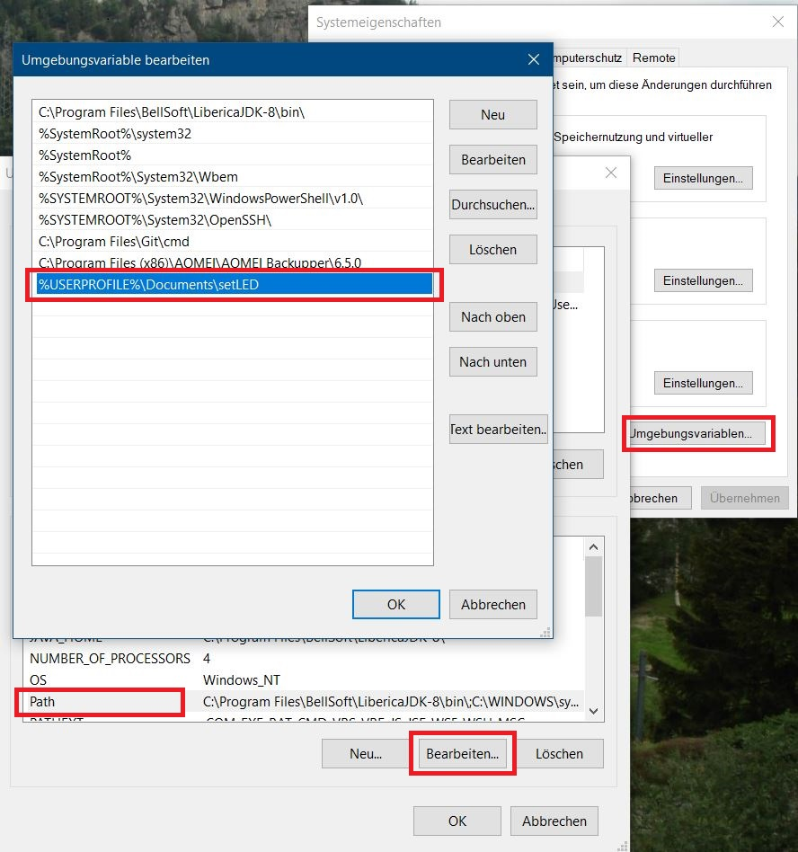
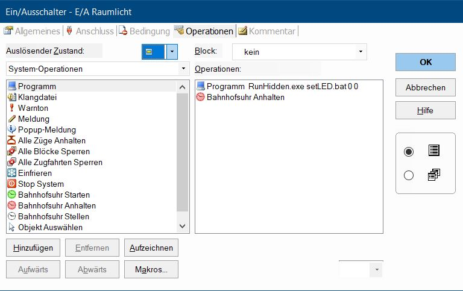

# setLED

## Einführung

setLED ist ein kleines Java Programm, um [LoDi-Light-Operator 4-C-LED](https://www.lokstoredigital.de/hardware/schalten/lodi-operator-4-c-led/), angeschlossen an [LoDi-Shift-Commander](https://www.lokstoredigital.de/hardware/schalten/lodi-shift-commander/), aus TrainController™ heraus zu steuern.

## Randbedingungen

setLED prüft die Eingabe-Parameter nicht. Eine falsche Eingabe führt zu einer Java Exception. 

## Hinweis

Um setLED unsichtbar aus TrainController™ heraus zu starten, kann das Programm  [RunHidden.exe](https://www.robvanderwoude.com/csharpexamples.php#RunHidden) benutzt werden. Andernfalls sieht man ein schwarzes Command Fenster solange setLED ausgeführt wird. 

## Schritt für Schritt Anleitung

Dieses Beispiel geht davon aus, dass setLED installiert ist in ``C:\Users\Dirk\Documents\setLED``. Dabei ist `Dirk` mit dem tatsächlichen Benutzer des PC zu ersetzen. 

### Dateien in den neuen Ordner "setLED" aus GitHub kopieren.

### In der Datei `setLED.bat` die IP-Adresse des LoDi-Shift-Commander eintragen.

### Windows Pfad anpassen

Dient dazu, damit man in TrainController™ keinen Pfad eingegeben werden muss. Dazu in Windows suchen nach "Erweiterte Systemeinstellungen anzeigen". 

### Übersicht Beispieldatei TC

### TC Ein/Ausschalter anlegen

- `setLED.bat 0 1` schaltet die Raumlicht-Kurve 1 bei Modul 0 ein.
- `setLED.bat 08:00` setzt die LoDi-Shift-Commander Zeit auf 8:00 Uhr.
- `setLED.bat 0 0` schaltet das Raumlicht bei Modul 0 aus.

### In TC ein Marco zum Blitzen anlegen

Das Macro wird dann in den Fahrplan um 23:00 eingetragen.

