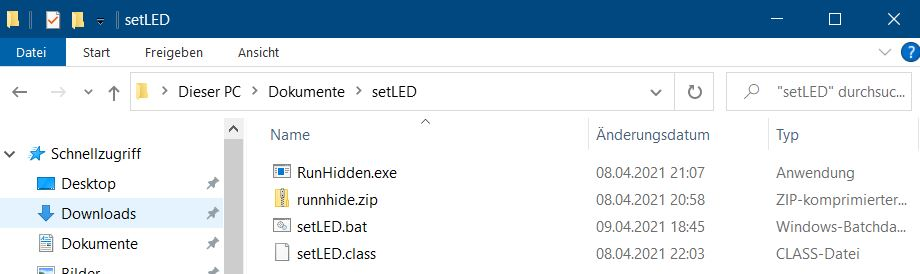

# setLED

## Einführung

setLED ist ein kleines Java Programm, um [LoDi-Light-Operator 4-C-LED](https://www.lokstoredigital.de/hardware/schalten/lodi-operator-4-c-led/), angeschlossen an [LoDi-Shift-Commander](https://www.lokstoredigital.de/hardware/schalten/lodi-shift-commander/), aus TrainController™ heraus zu steuern.

## Randbedingungen

setLED prüft die Eingabe-Parameter nicht. Eine falsche Eingabe führt zu einer Java Exception. 

## Hinweis

Um setLED unsichtbar aus TrainController™ heraus zu starten, kann das Programm  [RunHidden.exe](https://www.robvanderwoude.com/csharpexamples.php#RunHidden) benutzt werden. Andernfalls sieht man ein schwarzes Command Fenster solange setLED ausgeführt wird. 

## Schritt für Schritt Anleitung

Dieses Beispiel geht davon aus, dass das setLED.class Java Programm installiert ist im Ordner `%USERPROFILE%\Documents\setLED`. Das entspricht bei mir lokal `C:\Users\Dirk\Documents\setLED`. Dabei ist `Dirk` der Benutzer mit dem ich mich am PC anmelde.  

### 1. Dateien 

In den neuen Ordner `setLED` diese Dateien kopieren.

### 2. IP-Adresse setzen

In der Datei `setLED.bat` die IP-Adresse des LoDi-Shift-Commander eintragen.

### 3. Windows Pfad anpassen

Dient dazu, damit man in TrainController™ keinen Pfad eingegeben werden muss. Dazu in Windows suchen nach "Erweiterte Systemeinstellungen anzeigen". Dann wählen "Umgebungsvariablen". Dann `Path`unter "Systemvariablen" bearbeiten und Pfad von `setLED`hinzufügen.

### 4. setLED Kommandos

Der genaue Syntax ist in setLED.java beschrieben. 

Beispiele:
- `setLED.bat 0 1` schaltet die LoDi-Operator 4-C-LED Raumlicht-Kurve 1 bei Modul 0 ein.
- `setLED.bat 0 0` schaltet das LoDi-Operator 4-C-LED Raumlicht bei Modul 0 aus.
- `setLED.bat 07:00` setzt die LoDi-Operator 4-C-LED Zeit auf 7:00 Uhr.
- `setLED.bat F3` setzt die LoDi-Operator 4-C-LED Geschwindigkeit des Zeitablaufs auf ein 3-faches der normalen Zeit (Faktor 3).

### 5. Übersicht Beispieldatei TC

Voraussetzung TC 90 B3 Gold

### 6. TC Ein/Ausschalter anlegen

Operationen beim Einschalten

Operationen beim Ausschalten

### 7. TC Macro zum Blitzen anlegen

Operationen

Bedingungen

Das Macro wird dann in den Fahrplan um 23:00 eingetragen.

## Links

Diskussion dazu im [Lodi-Forum](https://www.lodi-forum.de/t345f18-LoDi-Operator-C-LED-und-TC.html)

